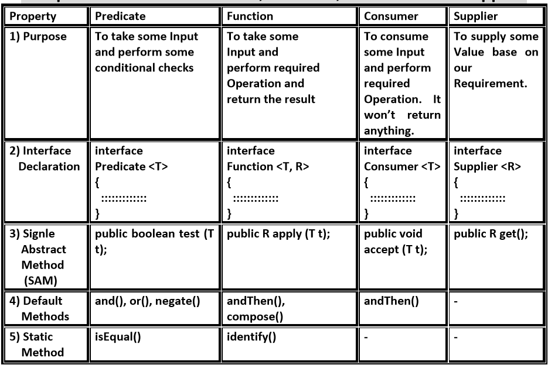

# Difference between Predicate and Consumer, Supplier functional interfaces?

Java is an Object-Oriented-Programming language(OOP). So apart from some primitive methods and data types, so for all
functions (methods as we called in Java) so in order to use these methods we have to use their classes or objects.

Functional interface is an interface that only contains one **_abstract method_** **SAM** (Single Abstract Method)
. They can have only one functionality to
exhibit. [Lambda expressions](https://github.com/Erk-Vural/turkcell-java-articles/tree/main/lambda-expressions) can be
used as
its implementation. A functional interface multiple default methods.

With Java SE 8 there are four main kinds of functional interfaces which can applided to multiple situations.


## Supplier

The Supplier functional interface is
a [Functional Interface](https://github.com/Erk-Vural/turkcell-java-articles/tree/main/functional-interfaces)
implementation that doesn't take any input or arguments and returns a single output. We use this type of functional
interface in lazy generation of values.Supplier functional interfaces are also used for defining the logic for the
generation of any sequence.

```
@FunctionalInterface
public interface Supplier<T>{
// gets a result
………….
 
// returns the specific result
…………
 
T.get();
}
```

_**Basic syntax of Supplier Functional Interface**_

```java
import java.util.function.Supplier;

class Main {
    public double squareLazy(Supplier<Double> lazyValue) {
        return Math.pow(lazyValue.get(), 2);
    }

    public static void main(String[] args) {
        Supplier<Double> lazyValue = () -> {
            Uninterruptibles.sleepUninterruptibly(1000, TimeUnit.MILLISECONDS);
            return 9d;
        };

        Double valueSquared = squareLazy(lazyValue);
    }
}
```

In above example we used supplier functional interface for lazy generation of values.It does not receive a value
itself, but a Supplier of this value. This allows us to lazily generate the argument for invocation of this function
using a Supplier implementation. This is useful when generation of the argument takes a considerable amount of time.

```java
class Main {
    int[] fibs = {0, 1};
    Stream<Integer> fibonacci = Stream.generate(() -> {
        int result = fibs[1];
        int fib3 = fibs[0] + fibs[1];
        fibs[0] = fibs[1];
        fibs[1] = fib3;
        return result;
    });
}
```

In above example we used supplier functional interface for creating **Fibonacci Series** , that generated with the help
of
the **_Stream.generate()_** method.  **_Stream.generate()_** method implements the supplier functional interface.
Supplier functional interface usually needs an external state like in the example we supply it with last the numbers of
sequence. All external variables used inside the lambda have to be effectively final.The different extensions of the
Supplier functional interface hold many other supplier functions like BooleanSupplier, DoubleSupplier, LongSupplier, and
IntSupplier. The return type of all these further specializations is their corresponding primitives only.

## Consumer

Consumer functional interface, accepts only one argument or a generified argument and returns nothing.

**_Syntax for Consumer functional interface_**

```
Consumer<Integer> consumer = (value) -> System.out.println(value);
```

List.forEach implements Consumer functional interface so on the example below we're going to print a list.

```java
import java.lang.reflect.Array;
import java.util.Arrays;
import java.util.List;

class Main {
    public static void main() {
        List<int> numbersList = Arrays.asList(1, 2, 3, 4, 5);

        numbersList.forEach(number -> {
            System.out.println("Number is: " + number);
        });
    }
}
```

There are also functional variants of the Consumer — DoubleConsumer, IntConsumer, and LongConsumer. These variants
accept primitive values as arguments. The most interesting one is **_BiConsumer_** interface.

**_BiConsumer_** interface takes two arguments. Both, Consumer and Bi-Consumer have no return value. It also returns
noting just like the Consumer interface.

```java
class Main {
    public static void main() {
        Map<String, Integer> mates = new HashMap<>();
        mates.put("luke", 20);
        mates.put("obi1", 56);
        mates.put("arturito", 2);

        mates.forEach((name, level) -> System.out.println(name + " is level " + level));
    }
}
```

In above example we used BiConsumer interface for iterating through the entries of the map of players.

## Predicate

> In scientific logic, a function that accepts an argument and, in return, generates a boolean value as an answer is
> known as a predicate.

Similarly, in the java programming language, a predicate functional interface is a type of function which
accepts a single value or argument and process it, and returns a boolean. A typical use case is to filter a collection
of values.

```java
import java.util.List;
import java.util.stream.Collectors;

class Main {
    public static void main() {
        List<String> players = Arrays.asList("luke", "obi1", "arturito")


        List<String> findLuke = players.stream().filter(player -> player.equals("luke")).toList();
    }
}
```

In above example we go thorough a list using Stream API and filter player name we were looking for using filter.

There are IntPredicate, DoublePredicate and LongPredicate versions of this function that receive primitive values.

**_Bi-Predicate_** is like **BiConsumer**  it is an extension of the Predicate functional interface, which, instead of
one, takes two arguments, does some processing, and returns the boolean value.

**_Syntax of Predicate Functional Interface_**

```
public interface Predicate<T> {
    boolean test(T t);
}
```


**_Comparison Table of Predicate, Function, Consumer and Supplier Functional Interface._**

## Resources

- Java Functional Interface and Lambda Expressions

  https://medium.com/ryanjang-devnotes/java-functional-interface-and-lambda-expressions-fe2bc9a9f1f


- Functional Interfaces in Java 8

  https://www.baeldung.com/java-8-functional-interfaces


- Functional Interfaces in Java

  https://www.geeksforgeeks.org/functional-interfaces-java


- Java Functional Interfaces

  https://jenkov.com/tutorials/java-functional-programming/functional-interfaces.html


- Java 8 | Consumer Interface in Java with Examples

  https://www.geeksforgeeks.org/java-8-consumer-interface-in-java-with-examples/
