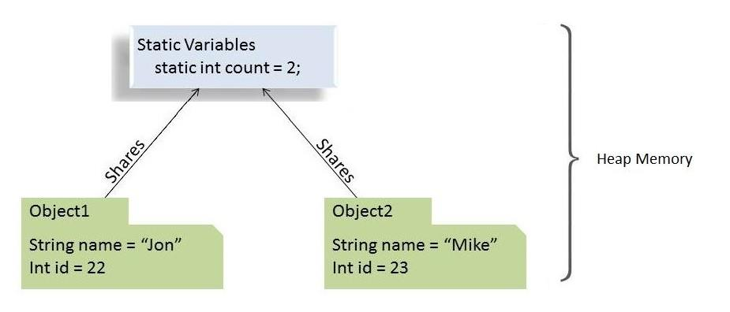

# What does static method mean for java, What is it used for ?

## What is Static keyword

In Java, **static** keyword means that particular member belongs to a type itself, rather than to an instance of that
type.
This means a static member of the class is shared across all instances of that class.
Static members can be accessed by using both class name and object reference.So we don't need to object references to
access static members of class.

We can apply the **static keyword** to:

- variables
- methods
- blocks
- nested



## Static Variable

We can declare a field static by prefixing the keyword to variable's declaretion. A static variable means, this variable
is shared across all instances of that class.
Static variables are stored in Heap memory .When the JVM
started [heap memory](https://www.azul.com/blog/what-is-java-heap-size) is created and any objects in the heap
memory can be shared across threads so static keywords is not thread safe.

```java

public class Student {
    private String name;
    private String number;

    public static String department;

    public Student(String name, String number) {
        this.name = name;
        this.number = number;
    }

    // Getters and Setters
}

class Main {
    public static void main(String[] args) {
        Student student1 = new Student("student1", "001");
        Student student2 = new Student("student2", "002");
        Student student3 = new Student("student3", "003");

        System.out.println(Student.department.equals(student1().department));
    }
}
```

In the example code above we declared departmant as a static variable and don't include it in the constructor. We can
use static variables when a field is same across all instances. So when new Student objects initialized they all can
access departmant field, and it will return the value assigned to it in class.

### Notes on static variables:

- Static members are beloong to class so, they can be accessed by using both class name and object reference so the
  above print stament will return True;
- Static variables can only be declared at class level.
- Static variabelse does not have **_this_** they can be set using Class itself.

When to use **static variables** :

- Value of variables is independent of objects.
- Value of variables needs to be shared across all objects.

## Static Method

Just like static variables, static methods belongs to class itself rather than objects. So we can call them without
object creation.

A noteble example for static method
is [public static void main](https://www.journaldev.com/12552/public-static-void-main-string-args-java-main-method)
class.

```java
class Student() {
    static String department;

    // fields, getters and setters

    public static void setDepartment() {
        Student.department = "Computer Science";
    }
}
```

In the example code above we use to set a static variable with a static method, we can use static methods to perform
operation that does not depend upon instance creations.

````java
public class Student() {
    public static computeCreditsLeftToGraditation(int currentCredits) {
        int totalCreditsNeededForGradiation = 240;

        return totalCreditsNeededForGradiation - currentCredits;
    }
}
````

We can also can and should static methods for helper or utility classes, so we can call them without object
initializations. Many classes such
as [Math](https://docs.oracle.com/en/java/javase/11/docs/api/java.base/java/lang/Math.html)
or [Collections](https://docs.oracle.com/en/java/javase/11/docs/api/java.base/java/util/Collections.html) using static
methods for utility methods.

### Notes on static methods:

- Static methods can't use **this** or **super** keywords.
- Static methods can not be overridden since overriding is a part of Runtime and static methods are resolved during
  compile time.
- [abstract methods](https://docs.oracle.com/javase/tutorial/java/IandI/abstract.html) can not be static (abstract
  methods required to initialized in subclasses).
- Instance methods can access static variables and methods.
- [Static methods](https://www.geeksforgeeks.org/static-methods-vs-instance-methods-java) can access only static
  variables and methods directly; for to be able to access instance variables and
  methods directly they require object references

## Static Block

We can use static blocks when initialization of static variables require some additional values along with declaretion.
A class can have multiple static blocks, and they run in the same order as they present in the class.

```java
public class StaticBlockDemo {
    public static List<String> studentLevels = new LinkedList<>();

    static {
        ranks.add("Freshmen");
        ranks.add("Sophomore");
    }

    static {
        ranks.add("Junior");
        ranks.add("Senior");
    }
}
```

In above example we initialized a list object with predefined values, It wouldn't be possible to initialize a List
object with all the initial values along with declaration. That's why we've utilized the static block here.

## Static Class

in Java, we can create nested classes it allows us to group elements that we will only use in one place. This keeps or
code more readable and organized.

### Notes on static classes:

- Static nested classes do not have access to any instance members of the enclosing outer class. It can only access them
  through an object's reference.

- Static nested classes can access all static members of the enclosing class, including private ones.

- Only nested classes can be static.

```java
public class Singleton {
    private Singleton() {
    }

    private static class SingletonHolder {
        public static final Singleton instance = new Singleton();
    }

    public static Singleton getInstance() {
        return SingletonHolder.instance;
    }
}
```

## Resources

- A Guide to the Static Keyword in Java

  https://www.baeldung.com/java-static


- static Keyword in Java

  https://www.geeksforgeeks.org/static-keyword-java


- Static methods vs Instance methods in Java

  https://www.geeksforgeeks.org/static-methods-vs-instance-methods-java/


- Static Method

  https://www.techopedia.com/definition/24034/static-method-java


- What exactly is a helper method?

  https://teamtreehouse.com/community/what-exactly-is-a-helper-method